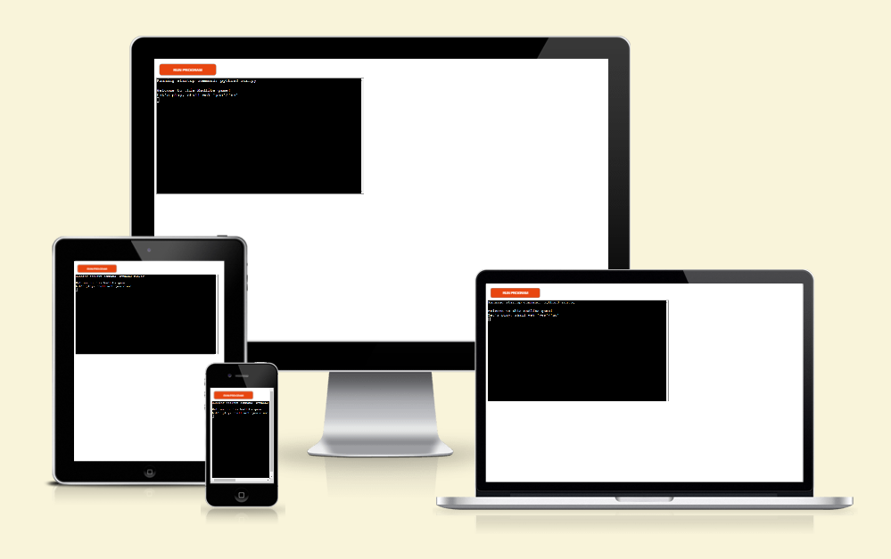
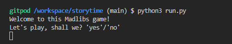
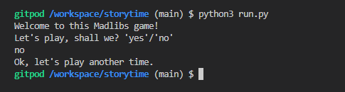
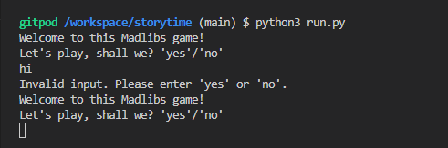
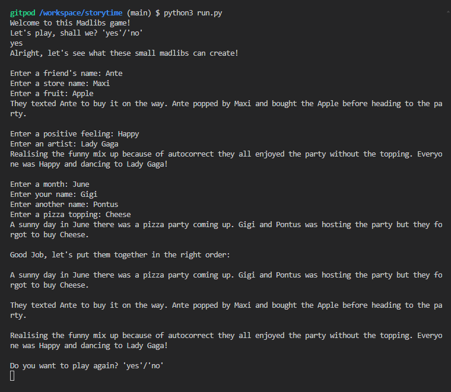
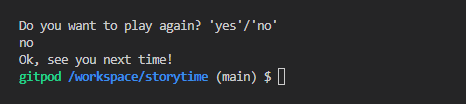
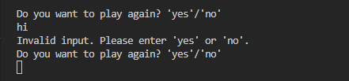
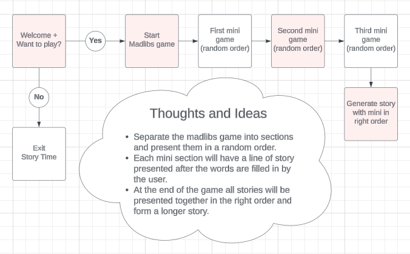

# Madlibs Game

This madlibs game is a Python terminal game and runs in the Code Insistute mock terminal on Heroku.

Link to deployed app: https://gigis-storytime-30d20dff6c88.herokuapp.com/

## How to play Madlibs Game

The game will be shown in different sections in a random order and build a sentence after ech section. Follow the instructions by entering what is requested. 

At the end of the game all sentences will be summarized together in the right order and you will be able to read the whole story with your own inputs. 

## Features

The game starts with a Welcome message together with a question if the user wants to play:

If user answers no, there will be a message saying: Ok, lets play another time:

If user answers with something else other than "yes" or "no" an error message will show:

If user answers yes, the game will begin. Presented in a random order three different sections will be presented, one after another. Asking the user to input the information asked. After each section the madlib story will be shown as well as the new section of game. 

At the end of the game, all the results from the mini madlibs results will be presented in the right order and form a story that will make more sense. Under the summarized result there will be a question asking the user if the would like to play again. If yes, the game will loop and start again:

If the user doesn't want to play again, "Ok, see you next time!" will be shown:

If invalid (user puts something else than "yes" or "no", an error message will be shown and the user would be asked to enter yes or no):

### Existing Features
- Madlibs are presented in a random order.
- User will be asked to input information, one by one.
- After each section, a sentence will be presented with the user input.
- At the end of the game all results will be put together in the right order and form a story. 
- Finally, there is a while loop added to ask the user if they want to play again. If yes, the game will start again. If no, the game will exit.

### Future Features
- Add or change the story and inputs
- Add different topics to choose from

## Flowchart

The diffrence between the flowchart I made at the planning phase of my project and during the building of the project is the "Do you want to play again?" - function added to the end. 

## Data Model

I have choosen to use the functions as a form of data model. I have the mini games which are representing different scenarios which will also take the inputs from users.

The list games kind of is the mother to the three scenarios, where we will have random shuffle, calling the functions, generate result and so on. 

## Testing

I have done all manual testing to make sure the game runs as it should. From the generally running through the game to different scenarios depending on the users answers. 

- I used PEP8 (https://pep8ci.herokuapp.com/) and passed my code through, the result was that my madlibs stories was too long so I did the line breaks and the issue was resolved.
- I tested if the game did as the users inputs (yes, no or invalid)
    - Yes: game starts
    - No: game will exit
    - Something other than yes or no: an invalid error message will show and the user will have to answer again. 

## Remaining bugs
- No bugs remaining in the code, the functions works as they should.

## Deployment

## Credits, sorces and resources
- CI Python Linter: https://pep8ci.herokuapp.com/
- Code Instisutes Love Sandwiches Walkthrough Project
- Python tutotial: https://www.youtube.com/watch?v=rfscVS0vtbw
- Github, Gitpod and Heroku

## Acknowlegde
- Thanks to the Slack Community for always keeping the spirits up.